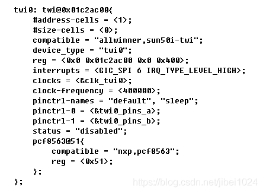

## 在helperboard a64下使用pcf8563实时时钟驱动

### 环境：

- 芯片：全志a64　　
- 内核：Linux3.10内核
- 主机：ubuntu16.04
- 开发板：[helperboard a64](https://item.taobao.com/item.htm?spm=a230r.1.14.27.6f7076ffgIj8Ws&id=563738220031&ns=1&abbucket=3#detail)
- 公司：[百杰科技](https://www.szbaijie.com/)
- github：[Baijie Technology](https://github.com/jizizh/baijie_blog)

### 问题

**因为pcf8563的驱动是linux内核自带的，网上也有很多分析的方法，之后再深入分析下pcf的驱动，写驱动，得首先使用它。**

###  一、设备树中添加设备节点

#### 1、设备树

以前各大厂商都会有自己的arm架构代码在内核当中，而我们只需要进入相应的架构修改代码就行了，但是之后的内核发生了很大变化，就是引入了设备树，首先如下图，我这样加PCF8563设备在设备树中


#### 2、修改内核配置

修改配置来增加pcf8563驱动。

```shell
make menuconfig ARCH=arm64
```

编译开机还是没有检测到RTC的信息。

### 二、查询问题

在内核里找到驱动代码，通过调试，发现代码没有进入probe函数，所以我们上面加入设备树中设备不成功。

在开发板通过以下命令知道TWI就是I2C。

```shell
find / -name device
```

查出如下图所示


通过下面命令查看i2c“ 0或者1”是否被使用：

```shell
i2cdetect -y 0
```

### 三、解决问题

在TWI0下加入我们的pcf8563设备和设置好**address-cells**和**size-cells**，如下图



### 四、成功打印


**注：可以在对应开发板配置文件中去加入pcf8563的配置信息，我这里是sys_config.fex里去修改也可以达到相应效果。** 